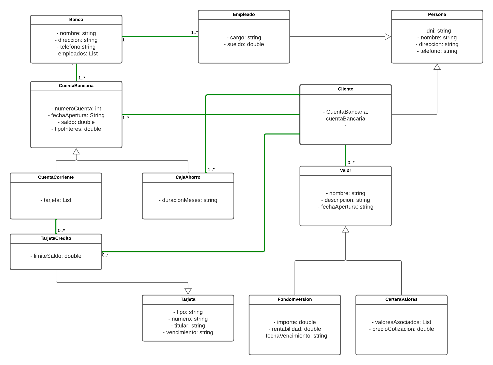

## Integrador 
### Gestionar productos asociados a los clientes de un banco.

Los productos que gestiona el banco son: cuentas bancarias, fondos de inversión y carteras de valores.
Las cuentas deben tener: número de cuenta, fecha de apertura, saldo y tipo de interés y los datos de sus clientes. 
El banco tiene dos tipos de cuentas: corrientes y cajas de ahorro.

Las cuentas corrientes pueden tener tarjetas de crédito asociadas. Solo estas cuentas pueden tener el resto de los productos asociados.

Las cajas de ahorro deben tener el número de meses que estarán abiertas. De los clientes se debe almacenar la siguiente información: 
DNI,nombre, dirección y teléfono.

Los fondos de inversión deben tener un nombre, importe, rentabilidad y la fecha de apertura y vencimiento.

Las carteras de valores están compuestas por los valores asociados, almacenando el nombre
del valor, el número de títulos y el precio de cotización.

Las tarjetas de crédito deben almacenar el tipo (Visa, MasterCard, etc.), el número, el titular y la fecha de caducidad.

----
# Resolución

Se realizo el siguiente **Diagrama de clases** representando jerarquía de clases y relaciones entre ellas desde un enfoque orientado a objetos

El objetivo de este sistema es gestionar los productos bancarios asociados a los clientes de un banco. Los productos que el banco maneja son cuentas bancarias, fondos de inversión y carteras de valores. A continuación, se detallan las clases y sus relaciones:

## Clases:

**Banco:** Representa la entidad del banco en general, con sus operaciones y funciones relacionadas con la gestión de productos y clientes.

**Empleado:** Representa a los empleados del banco. Hereda de la clase Persona.

**Persona**: Clase abstracta que contiene atributos y métodos comunes a los clientes y empleados del banco.

**Cliente:** Representa a los clientes del banco. Almacena información como DNI, nombre, dirección y teléfono.

**CuentaBancaria**: Clase que representa una cuenta bancaria. Contiene atributos como número de cuenta, fecha de apertura, saldo y tipo de interés.

**CuentaCorriente:** Subclase de Cuenta. Representa las cuentas corrientes que pueden tener tarjetas de crédito asociadas.

**CajaAhorro:** Subclase de Cuenta. Representa las cajas de ahorro que deben tener el número de meses que estarán abiertas.

**TarjetaCredito:** Subclase de Tarjeta. Representa las tarjetas de crédito y puede contener atributos adicionales relacionados con el crédito.

**Tarjeta:** Clase abstracta que representa una tarjeta bancaria. Contiene atributos como tipo (Visa, MasterCard, etc.), número, titular y fecha de caducidad.

**Valor:** Representa los valores asociados a las carteras de valores. Almacena información como el nombre, número de títulos y precio de cotización.

**FondosInversion:**Subclase de Producto. Representa los fondos de inversión con atributos como nombre, importe, rentabilidad, fecha de apertura y vencimiento.

**CarteraValores:** Subclase de Producto. Representa las carteras de valores compuestas por valores asociados, almacenando el nombre, número de títulos y precio de cotización.

## Relaciones:

**CuentaBancaria - CuentaCorriente/CajaAhorro: Herencia.** Las clases CuentaCorriente y CajaAhorro heredan de la clase Cuenta, permitiendo compartir atributos.

**CuentaCorriente - TarjetaCredito: Asociación.** Una cuenta corriente puede tener ninguna o muchas tarjetas de crédito asociadas.

**Banco - CuentaBancaria: Asociación.** Un Banco puede tener 1 o más cuentas asociadas además cada cuenta bancaria esta asociada a un único banco

**Cliente - CuentaBancaria: Asociación.** Un cliente puede tener una o muchas cuentas bancarias.

**Cliente - Valor: Asociación.** Un cliente puede tener ninguna o varios productos bancarios.

**Cliente - TarjetaCredito: Asociación.** Un cliente puede tener ninguna o muchas tarjetas de crédito

**Cliente - CajaAhorro: Asociación.** Un cliente puede tener una o muchas Cuentas Bancarias

**Cliente - Persona: Herencia.** La clase Cliente hereda de la clase Persona permitiendo compartir atributos

**Valor - FondosInversion/CarteraValores: Herencia.** Las clases FondosInversion y CarteraValores heredan de la clase Producto, permitiendo compartir atributos y comportamientos comunes.

**Persona - Empleado/Cliente: Herencia.** La clase Empleado/Cliente hereda de la clase Persona, permitiendo compartir atributos y comportamientos comunes.
**Empleado - Banco: Asociación.** Un empleado puede tener un banco Y un banco puede tener 1 o muchos empleados
